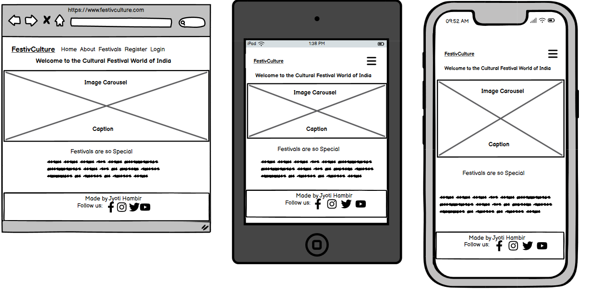

<h1 align="center"> FestivCulture <h1>
<h2 align="center"> Welcome to the Cultural Festival World of India <h2>

- India is having 28 states and each states are Unique in Celebrating Festivals, speaking Languages, having there
      own special foods for the every Festival.

- This Website has made for the people who wants to know Indian Festival and there Culture, how they celebrate it,
      whats the reason behind every festival.

- This Website blog having Festival's brief information and when its celebrated what foods they preparing for make
      this festival more special.

## [Content](#content)

 -----

 # User Experience - UX

 ## Site Aims

* 
* 

 ## Agile Methodology

The Agile Methodology was used to plan this project. This was implemented through Github and the Project Board. Through the use of the Kanban board in the projects view in Github, the project was divided into a few different sections: 

* To Do- (All the User stories were initially entered in the 'To Do' column)
* In Progress- (then during development story they were moved into the 'In Progress' column)
* Done- (and then finally they get moved into 'Done' once the development completes)

Please find my Kanban Board with my user stories [here](https://github.com/users/JyotiHambir-BC/projects/9/views/1)

## User Stories

## Design

### Typography

* Fonts were imported using Google Fonts. Poppins was used throughout with a backup of sans-serif. It was chosen for easy readability for users.
* Protest Guerrilla font was used for website name **"FestivCulture"**

### Imagery

### Wireframes

**Homepage**

**About Page**

**Festivals Page**

**Festivals Blog Page**

**Register Page**

### Database Diagram

Smart Draw was used to create a database schema to visualise the types of custom models the project requires. This schema was used as a guide to what needed to be added to each model. Below is the Database structure that this project is based on. The relationship between Entities Post and Comment are shown in this diagram.

