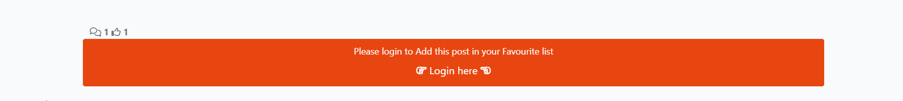
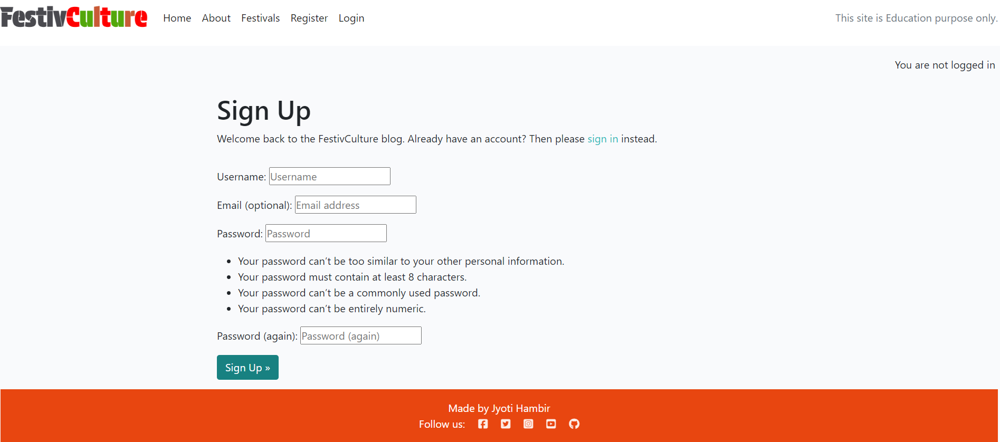

<h1 align="center"> FestivCulture <h1>
<h2 align="center"> Welcome to the Cultural Festival World of India <h2>

## Purpose and Targeted Audience
- India is having 28 states and each states are Unique in Celebrating Festivals, speaking Languages, having special foods for the every Festival.

- This Website has made for the people who wants to know Indian Festival and there Culture, how they celebrate it, whats the reason behind every festival.

- This Website blog having Festival's brief information and when its celebrated what foods they preparing for make this festival more special.

### The live link is available here [FestivCulture](https://festive-culture-18e558f91174.herokuapp.com/)

-----------------------------------------------------------------------------------------------------------------

## [Content](#content)

-----------------------------------------------------------------------------------------------------------------

 # User Experience - UX

 ## Site Aims

* FestivCulture is a website mainly meant to explore the Indian Festivals with a good user experience.
* This website provides the user with the ability to read and view posts of festivals.
* All users who sign up and sign in, can access the features of all posts, can add them in there personal favourite list, like/unlike and comment on a blog post of this website.

 ## Agile Methodology

The Agile Methodology was used to plan this project. This was implemented through Github and the Project Board. Through the use of the Kanban board in the projects view in Github, the project was divided into a few different sections: 

* To Do- (All the User stories were initially entered in the 'To Do' column)
* In Progress- (then during development story they were moved into the 'In Progress' column)
* Done- (and then finally they get moved into 'Done' once the development completes)

### Please find my Project Board with my user stories [here](https://github.com/users/JyotiHambir-BC/projects/9/views/1)

-----------------------------------------------------------------------------------------------------------------

## User Stories

#### For Admin
* As a site admin, I can create draft posts so that I can finish writing the content later.
* As a site admin/author, I can create, read, update and delete (CRUD) posts to manage the blog content.
* As a site admin, I can delete any comment or have authority to approve the comments posted by registered user so that I can filter out objectionable comments.
* As a author, I can access all my blog posts easily in one place so that I can easily track my activity on the site.

#### For Visitor of website
* As a site visitor I can easily see the purpose of the site from the landing page so that I can see if the site is relevant to my needs.
* As a site visitor I can view a list of festivals so that I can see the available festival blogs.
* As a site visitor I can view a paginated list of posts so that easily select a post to view.
* As a site visitor I can click on a post so that I can read the full article.
* As a site visitor, I can view comments on an individual post so that I can read the conversation.
* As a site visitor, I can view the number of likes on each post so that I can see which is the most favourite festival blog or viral blog.
* As a site Visitor, I can register an account so that I can comment and like.

#### For Registered / logged-in Users
* As a registered user, I can login and logout of the site so that I can access my content.
* As a logged-in user I can leave comments on a post so that I can be involved in the conversation.
* As a logged-in user I can edit/delete my comments so that I can update/delete my post opinion.
* As a logged-in user I can like or unlike a post so that I can interact with the content.

-----------------------------------------------------------------------------------------------------------------

## Design

* To choose the colour I used [Faltui Colour Picker](https://www.flatuicolorpicker.com/colors/vivid/)

### Typography

- Fonts were imported using Google Fonts. 
  - **Poppins** was used throughout with a backup of **sans-serif**. It was chosen for easy readability for users.
  - **Merriweather** font used for quotes written on homepage below the carousel to give different style than normal fonts.
  - **Protest Guerrilla** font was used for website name **"FestivCulture"** to make it stylish.

-----------------------------------------------------------------------------------------------------------------

### Imagery

* All the added images in festivals blogs and About page are taken from Google and uploaded by Admin via Admin Panel.
Default image also set for these blogs and about page, if no image uploaded by Admin/Author when posted a blog.

-----------------------------------------------------------------------------------------------------------------

### Wireframes

**Homepage**

**About Page**

**Festivals Page**

**Festivals Blog Page**

**My Favourite Page**

**Register Page**

### Database Diagram

Smart Draw was used to create a database schema to visualise the types of custom models the project requires. This schema was used as a guide to what needed to be added to each model. Below is the Database structure that this project is based on. The relationship between Entities Post and Comment are shown in this diagram.

# Features

## Home Page

At the very first glimpse, user can see a Navigation menu and carousel-images with the captions inside and quote about the festival below the carousel on the homepage. Homepage provides the user with some quick information about the site and make use of all its features. User do not need to be registered to view a blog post. The responsive navigation bar is featured on all pages. 

## Navbar

- The navigation bar is present at the top of every page and navigates all links to the respective pages.
- The options to Register or Log in will change to the option to log out once a user has logged in.
- The navbar is fully responsive, collapsing into a hamburger menu when the screen size becomes smaller.

#### Navbar when not logged in :

#### Navbar when already logged in :

## Footer

- On the website footer, users can see basic information such as my social media, copyright about FestivCulture Website.

## About Page

- The About Page gives, users information about the purpose of celebrating festivals in India with a brief discription of india and the travel options to reach there.

## Festivals Page

- On a Festival page there is list of all festivals and paginated by 6 posts on the page.
- Further post can be accessed by clicking next button. Each blog post shows the image overlay with the festival information.

- After click on Next Button in the middle page Next and Prev both buttons are available to move-on next page or go on previous page.

## Festivals blog Details Page

- When a user clicks on the title or text of the blog post, they are brought to the post details page for the selected blog post. Here the user is shown the complete details of the blog post with image, author name, created time, title, when the festival is celebrated, number of likes and comments along with full content.
- Underneath the post description the page Add to Favourite button is available, so if user like the post he can add that post in his / her favourite list.
- Below that button displays all the approved comments on that blog post posted by signed-in users. 
- At the bottom of this page, the Comment box is visible to the users.

-----------------------------------------------------------------------------------------------------------------

#### For Not Signed-In User

- If user not signed-in, following button will appear. It also have the login link attached under "Login here", so user can directly navigate to the Sign-In page. 

-----------------------------------------------------------------------------------------------------------------
#### For Signed-In User

- If user is signed-in, following button will appear. And if user clicked on this button the added on message will display.

- If user is signed-in, and already added the post in Favourite list then following button will appear. And if user clicked on this button the removed from message will display.

-----------------------------------------------------------------------------------------------------------------
### Blog page Comment Section

- If user is signed-in, following comment box will appear. And user can see there own unapproved comments (if any) or all approved comments posted by different users.

* Submitted comment which is waiting for admin approval

* Comments which admin have approved already.

* When User submit a comment or like/unlike a post, following messages/ alert displays respectively.

-----------------------------------------------------------------------------------------------------------------

### Blog page Like Section

* When User like the Post

* When User unlike the Post

* These Comment and Like Icons displaying above the comment box and it shows how many like and approved comments received for the Post from the Users.

-----------------------------------------------------------------------------------------------------------------

- Signed-in users can only edit/delete their own comments.

- When the user clicks on the delete button to remove his comment, following alert message pops up.

- When the user clicks on the delete button again, following alert message pops up.

- When user clicks on  Edit button, the existing comment's text appeared in body box to change, if user wants to change / update anything in existing comment. And the Submit button will change into Update button as shown below.

- When user clicks on update button, a successful update alert message is displayed and the updated comment will show in comments list.

-----------------------------------------------------------------------------------------------------------------

## My Favourite blog Details Page

* In this page you can see your added favourite post. When user click on Add to Favourite Button which is below the post, that favourite post is adding to this My Favourite page and also when the post added to that list its also appear bottom of the post. If user remove the post from favourite, it will disappear from this list again.

* If there is no post added in My Favourite below message will display when you open the My Favourite App.

-----------------------------------------------------------------------------------------------------------------

## Security
In order to properly interact with the website, the user needs to have an account and sign in. This ensures security of their comments and gives them rights to create, modify and delete them.

### Sign Up

- User is asked to enter username and password to sign up. User will be guided by validation messages if the username exists or password is too small which was created by modifying Django inbuilt templates. 

- When users sign up to the website they will see a message at the top of the page saying "Successfully signed in as (username)".

### Sign In

- The Sign In page will display when User will click on login page

- User can enter username and password to sign in. User will be guided by validation messages if the username or password is not correct. This was created by modifying Django inbuilt templates.

- When users sign in to the website they will see a message at the top of the page saying "Successfully signed in as (username)".

### Sign Out

- If the user is signed-in, then only they can see Logout nav-item in navbar. User will be taken to the Sign Out page. This was created by modifying Django inbuilt templates. When the user signs out, they are redirected to homepage.

- When users log out of the website they will see a message at the top of the page saying "You have signed out".

-----------------------------------------------------------------------------------------------------------------

## Admin Panel/Superuser

- Admin accesses the project via logging into Django admin panel with a superuser id and password. The page appears as shown [here](assets/admin-panel/admin_panel_homepage.png)
- A superuser "admin" was created for this project to manage the admin panel.
- On the Admin Panel, as an admin I have full access to CRUD functionality so I can view, create, edit and delete the following ones:
  - Posts
  - Comments
  - Author
- As admin I can also approve comments and change the status and give other permissions to the users.

### Admin 'Post' Model Management

- On selecting Blog "Post", a list of blog posts is displayed with its title, slug, status, created_on and author name. Admin can select the post and edit or delete its data.
- When the status is set to Publish on Admin Approval, the post starts appearing in the website.

`The admin site for post model appears as shown` [here](assets/admin-panel/post_model.png).

### Admin 'Comment' Model Management

- Upon selecting the Blog "Comment" model, a list of comments on a post is displayed with the username, comment body, post title, status and created_on. Admin can select the comment and edit or delete its data.

`The admin site all comments list appears as shown` [here](assets/admin-panel/comment_model.png).

- When a comment is submitted by a user, it requires approval from an admin in order to publish it on the comments section.

`The admin site for comment model approval appears as shown` [here](assets/admin-panel/comment_approve.png).

### Admin 'Author' Model Management

- Upon selecting the Blog "Author" model, a list of Author on a post is displayed with the username, Email, Approved, Image. Admin can select the User for add it as author and update a picture for his profile and edit or delete its data.

`The admin site for Author model appears as shown` [here](assets/admin-panel/add_author.png)

-----------------------------------------------------------------------------------------------------------------

## Technologies Used

### Languages Used

* [HTML 5](https://en.wikipedia.org/wiki/HTML/)- Used to structure all the templates on the site
* [CSS 3](https://en.wikipedia.org/wiki/CSS)- to provide extra styling to the site
* [JavaScript](https://www.javascript.com/)- Minimum javascript was used to fade out alerts after a few seconds.
* [Python](https://www.python.org/)- To provide the functionality to the site. Packages used in the project can be found in requirements.txt

### Django Packages

* [Gunicorn](https://gunicorn.org/)- As the server for Heroku.
* [Cloudinary](https://cloudinary.com/)- Was used to host the static files and media for the site.
* [Dj_database_url](https://pypi.org/project/dj-database-url/)- To parse the database URL from the environment variables in Heroku.
* [Psycopg2](https://pypi.org/project/psycopg2/)- As an adaptor for Python and PostgreSQL databases.
* [Summernote](https://summernote.org/)- As a text editor.
* [Allauth](https://django-allauth.readthedocs.io/en/latest/installation.html)- For authentication, registration, account management.
* [Crispy Forms](https://django-crispy-forms.readthedocs.io/en/latest/)- To style the forms.

### Frameworks - Libraries - Programs Used

* [Django](https://www.djangoproject.com/) was used as the framework for the back-end logic of the project. Django enables rapid and secure development.
* [Bootstrap](https://getbootstrap.com/)- Used to style the website, add responsiveness and interactivity.
* [Git](https://git-scm.com/)- Used for version control by utilizing the Gitpod terminal to commit to Git and push to GitHub.
* [GitHub](https://github.com/)- Used to store the project's code after being pushed from Git.
* [Heroku](https://id.heroku.com)- Used to deploy the live project.
* [PostgreSQL](https://www.postgresql.org/)- Database used through heroku.
* [Balsamiq](https://balsamiq.com/)- To build the wireframes for the project.
* [Google Chrome Developer Tools](https://developers.google.com/web/tools/chrome-devtools) was used to inspect page elements, debug, troubleshoot and test features and adjust property values. Using the Lighthouse extension installed in Chrome Browser, the performance report was generated.
* [Google Fonts:](https://fonts.google.com/) used for the Poppins and Protest Guerrilla font
* [Font Awesome:](https://fontawesome.com/) was used to add icons for aesthetic and UX purposes.

-----------------------------------------------------------------------------------------------------------------

## Testing

### Manual Testing:

Testing has taken place continuously throughout the development of the project. Each view was tested regularly.

[Manual Testing Report](assets/documentations/manual_test/Manual%20tests.png)

-----------------------------------------------------------------------------------------------------------------

### Validation
I used the following validation tools to validate HTML, CSS, PYTHON codes. Below the link of TESTING.md file, which includes all validation results.  
- HTML using [W3C HTML validator](https://validator.w3.org/)
- CSS using [Jigsaw CSS validator](https://jigsaw.w3.org/css-validator/)
- Python via [PEP8 CI Python Linter](https://pep8ci.herokuapp.com/)

### Validation Report

| **Homepage HTML Validation** |
| ----------- | 
| 

Homepage HTML Validation

 

| **About-page HTML Validation** |
| ----------- | 
| Two Errors has found in validation report which was checked but it is present in Summernote App, which not able to correct in html file.

Aboutpage HTML Validation

 

| **Festival-page HTML Validation** |
| ----------- | 
| 

Festival-page HTML Validation

 

| **Individual Blog Page HTML Validation** |
| ----------- | 
| There are 29 Errors and 1 warning found during validation which is again belongs to Summernote App, which can't be fixed in html page in gitpod 

Individual Blog Page HTML Validation

 

| **My Favourite Page HTML Validation** |
| ----------- | 
| 

My Favourite Page HTML Validation

 

| **Register Page HTML Validation** |
| ----------- | 
| Four Errors found during the validation which are belongs in allauth app installation, not changed any html file related to authentication. 

Register Page HTML Validation

 

| **Login Page HTML Validation** |
| ----------- | 
| 

Login Page HTML Validation

 

| **CSS Validation** |
| ----------- | 
| 

CSS Stylesheet Validation

 

-----------------------------------------------------------------------------------------------------------------

## Bugs

| **Unfix Bug** |
| ----------- | 
| When a logged in user adds a post in there favourite list, on My Favourite page the post is adding but the Post added on favourite date shows incorrect and same for all added post in favourite list. 

My Favourite Page Screenshot

 

-----------------------------------------------------------------------------------------------------------------

## Future Implementation
* Search Bar on top-right side of website to search the information or blog.

-----------------------------------------------------------------------------------------------------------------

## Deployment

### 1. Creating the Django Project
* Go to the Code Institute Gitpod Full Template [ci-full-template](https://github.com/Code-Institute-Org/ci-full-template).
* Click on `Use This Template` button, then create new repository.
* Name our repository and click on `Create repository from template` button.
* Once the template is available in your repository click on `Gitpod` button.
* When the image for the template and the Gitpod are ready, open a new terminal to start a new Django App.
* Install Django and gunicorn: `pip3 install 'django~=4.2.1' gunicorn~=20.1`.
* Create a Procfile `Procfile has no extension and P should be Capital`.`Add 1 line code web: gunicorn (project-name).wsgi`.
* Install supporting database libraries dj_database_url and psycopg2 library: `pip3 install dj_database_url==0.5.0 psycopg2`.
* Install Cloudinary libraries to manage static files: `pip install dj-3-cloudinary-storage`.
* Install whitenoise to serve the static files: `pip3 install 'whitenoise~=5.3.0'`
* Create file for requirements: `pip freeze --local > requirements.txt`.
* Create project:`django-admin startproject project_name .`.
* Create app: `python manage.py startapp app_name`.
* Add app to list of `installed apps` in settings.py file: `'app_name'`.
* Migrate changes: `python manage.py migrate`.
* Test server works locally: `python manage.py runserver`.
* If the app has been installed correctly the window will display- The install worked successfully! Congratulations!

### 2. Create your Heroku app
* Navigate to [Heroku](https://id.heroku.com).
* Create a Heroku account by entering your email address and a password (or login if you have one already).
* Activate the account through the authentication email sent to your email account.
* Click the **new button** on the top right corner of the screen and select create a new app from the dropdown menu.
* Enter a unique name for the application.
* Select the appropriate region for the application.
* Click create app.
* Click Reveal Config Vars and add a new record with `DATABASE_URL`.
* Click Reveal Config Vars and add a new record with `PORT`.
* Click Reveal Config Vars and add a new record with the `DISABLE_COLLECTSTATIC = 1`(note: this must be either removed or set to 0 for final deployment).
* Next, scroll down to the Buildpack section, click `Add Buildpack` select python and click Save Changes.

### 5. Heroku Deployment: 
* Click Deploy tab in Heroku.
* Select Github as the deployment method.
* Confirm you want to connect to GitHub.
* Search for the repository name and click the connect button to link the heroku app with the Github repository. The box will confirm that heroku is connected to the repository.
* Scroll to the bottom of the deploy page and select the preferred deployment type.
* Click either Enable Automatic Deploys for automatic deployment when you push updates to Github or To manually deploy click the button 'Deploy Branch'. The default 'main' option in the dropdown menu should be selected in both cases. When the app is deployed a message 'Your app was successfully deployed' will be shown. Click 'view' to see the deployed app in the browser.

### 6. Final Deployment
In the IDE:
* When development is complete change the debug setting to: `DEBUG = False` in `settings.py` 
* In Heroku settings config vars change the `DISABLE_COLLECTSTATIC` value to 0
* Because DEBUG must be switched to True for development and False for production it is recommended that only manual deployment is used in Heroku. 
* To manually deploy click the button 'Deploy Branch'. The default 'main' option in the dropdown menu should be selected in both cases. When the app is deployed a message 'Your app was successfully deployed' will be shown. Click 'view' to see the deployed app in the browser.

-----------------------------------------------------------------------------------------------------------------

# Credits

## Code
- The basic set up of the website was done by strictly following the steps as described in Code Institue Full Stack Frameworks module - Django walkthrough project `"I Think Therefore I Blog"`.
- [Incredible India](https://github.com/jyotiyadav2508/Blog_Website_PP4)- One of the project shared by my cohort facilitator on Slack. 

## Learning Resources
- Code Institutes Full Stack Framework Module, mainly the 'blog' walkthrough project.
- [W3CSchool](https://www.w3schools.com/django/)
- Other open source to understand and solve different types of error : ChatGPT, Stack Overflow
- Taken idea of add post in favourite list from youtube videos by [Abhishek Verma](https://www.youtube.com/watch?v=1XiJvIuvqhs)

## Content and Media

All images and post content are taken from the [google](https://www.google.com/search?sca_esv=d48fcc0fc18d8628&rlz=1C1CHBF_enGB1125GB1125&sxsrf=ADLYWIINrTTNC86lbltlpSGsQIcdXZMQEw:1728029356412&q=indian+festivals+celebration+information&udm=2&fbs=AEQNm0Aa4sjWe7Rqy32pFwRj0UkWd8nbOJfsBGGB5IQQO6L3J5MIFhvnvU242yFxzEEp3BcbXWGQjBp6XyyqfUu6Wz8hhClm-XLh0MrkVdZRZIb1tDN85Hu7JjwJZYSVOmzHOT7s_qMZXV-Qr0zdnVvAyGGIKM4oPPacutpZcdLFQqMKi8RzYR842wSoR0Aq3Tgd4c7txK2F&sa=X&ved=2ahUKEwjL8Mz_ovSIAxV2T0EAHZk0CD0QtKgLegQIFxAB&biw=1536&bih=695&dpr=1.25) 

## Acknowledgement
Special thanks to my facilitator Elaine Roche, My fellow students Laura and Simmi, Coading Coach Ruairidh MacArthur and John Rearden and Slack community for their assistance throughout this project.

-----------------------------------------------------------------------------------------------------------------

[Back to top](<>)
   
